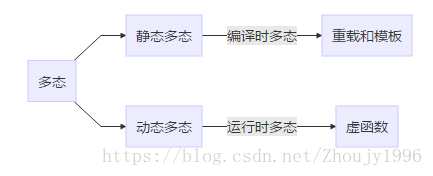

# C++
## 原码 反码 补码
  反码：正数不变；负数符号位不变，其余取反
  补码：正数不变；负数符号位不变，从右往左第一个1之前保留，之后取反/反码+1
## 内存溢出与内存泄露
  两者关系：内存泄露 → 剩余内存不足 → 后续申请不到足够内存 →内存溢出。
  - 内存溢出：申请不到足够的内存；
  - 内存泄露：无法释放已申请的内存；
    - 内存泄露的原因：new创建的对象没有及时delete/delete错误（使用已经释放的对象/同一块内存释放两次）：
      1. 构造函数new创建出来的对象，析构函数没有delete
      2. 释放对象数组时只调用了delete而非delete []：
        导致只有对象数组的第一个对象的析构函数得到执行并回收了内存占用，数组的其他对象所占内存得不到回收
      3. 没有将基类的析构函数定义为虚函数:
        当**基类指针**指向派生类对象时，派生类中有动态分配的内存，如果基类的析构函数不是virtual，那么**派生类的析构函数将不会被调用**，派生类的资源没有正确释放
        ```C++
        Fruit *basket[2]; // 基类指针指向派生类
        basket[0] = new Apple;
        basket[1] = new Banana;
        for (i = 0; i < 2; ++i){
            delete basket[i];
        }
        ```
      4. 对指针/对象进行浅拷贝：
        导致拷贝前后两个对象指向**同一个地址空间**，内存被释放两次；【深浅拷贝】
      5. 在外部函数分配的堆内存，不要在调用函数里面释放，而在外部函数内释放；
      6. ~~delete掉一个void*类型的指针：~~
        导致**没有调用到对象的析构函数**，析构的所有清理工作都没有去执行
      7. ~~没有正确地清除嵌套的对象指针~~
        某个对象以引用语义（指针）了包含另一个对象，而不是以值的方式。
        解决办法：基类/继承类各管各的内存，在构造函数里面分配内存，virtual析构函数各自释放内存
      8. ~~指向对象的指针数组不等同于对象数组:~~
        对象数组:数组中存放的是对象，只需要delete []p，即可调用对象数组中的每个对象的析构函数释放空间；<p>
        指向对象的指针数组是指：数组中存放的是指向对象的指针，不仅要释放每个对象的空间，还要释放每个指针的空间，delete []p只是释放了每个指针，但是并没有释放对象的空间 -> 正确的做法，是通过一个循环，将每个对象释放了，然后再把指针释放了。
    - 内存泄漏避免方法：
      1. new和delete运算符配对使用的习惯，在自由存储空间上动态分配，使用完毕后释放。
      2. 智能指针：智能指针可以自动删除分配的内存。智能指针和普通指针类似，只是不需要手动释放指针，而是通过智能指针自己管理内存的释放。
## 野指针 与 悬空指针
### 野指针
- 造成野指针的原因：指针变量**没有初始化**（如果值不定，可以初始化为NULL）
### 悬空指针
- delete之后，指针就变成了悬空指针，即**指向**一块曾经保存数据对象但现在**已经无效的内存的地址**，编译器**只会释放该指针所指向的内存空间并回收**，之后可以分配给新开辟的空间，而**不会删除这个指针本身**
- 避免悬空指针的问题：在指针即将要离开其作用域之前释放掉它所关联的内存，使得指针**不指向任何对象**；否则若之后定义一个指针，将之前释放掉的内存空间分配给他，则两个指针同时指向同一个内存空间
- 因此删除一个指针之后，一定将该指针设置成空指针（delete *p之后一定要加上： p=NULL/p=nullptr）

### 那这两个算什么？
~~指向**被释放**的或者**访问受限内存**的指针。~~
~~指针操作**超越了变量的作用范围**，比如返回指向栈内存的指针就是野指针。~~
## 浅拷贝/位拷贝 与 深拷贝/值拷贝
  - 浅拷贝：**拷贝地址，对指针的拷贝**，拷贝后两个指针指向同一个内存空间 
    问题：
    1. 两个（或两个以上）指针指向同一块空间，内存会被多次释放
    2. 两个对象绑定，一旦一个指针修改了这块空间的值，另一个指针指向的空间的值也会被修改。
  - 深拷贝：**拷贝内容，对指针和指针指向的内容进行拷贝**，拷贝后两个指针指向两个不同地址的指针
    开辟一块新地址空间，将需要拷贝的内容赋值到新地址空间
    改进：引用计数的写时拷贝->引用计数的写时拷贝，读有时也会拷贝
    当对象中存在指针成员时，除了在复制对象时需要考虑**自定义拷贝构造函数**，还应该考虑以下两种情形：
    1. 当函数的参数为对象时，实参传递给形参的实际上是实参的一个拷贝对象，系统自动通过拷贝构造函数实现；
    2. 当函数的返回值为一个对象时，该对象实际上是函数内对象的一个拷贝，用于返回函数调用处。
  参考：https://blog.csdn.net/xu1105775448/article/details/80546950
## 继承——派生类中使用基类private对象
#### 构造函数
  ```C++
  class Brass
  {
  private:
    std::string fullName; long acctNum; double balance;
  public:
    Brass(const std::string & s = "Nullbody", long an = -1, double bal = 0.0);
    void Deposit(double amt);
    virtual void Withdraw(double amt);
    double Balance()const;
    virtual void ViewAcct()const;
    virtual ~Brass() {}
  };

  class BrassPlus :public Brass
  {
  private:
    double maxLoan; double rate; double owesBank;
  public:
    BrassPlus(const std::string & s = "Nullbody", long an = -1, double bal = 0.0, double ml = 500, double r = 0.11125);
    BrassPlus(const Brass & ba, double ml = 500, double r = 0.11125);
    virtual void ViewAcct()const;
    virtual void Withdraw(double amt);
    void ResetMax(double m) { maxLoan = m; };
    void ResetRate(double r) { rate = r; };
    void ResetOwes() { owesBank = 0; }
  };
  ```

- 派生类初始化基类private成员，采用**成员初始化列表语法**；除非使用没默认构造函数，否则应该显示调用基类构造函数
  ```C++
  BrassPluss::BrassPlus(const string& s, long an, double bal, double ml, double r): Brass(s, an, bal){
    maxLoan=ml;
    owesBank=0.0;
    rate=r;
  }
  ```
- 也可以对派生类成员使用成员初始化列表语法
  ```C++
  BrassPluss::BrassPlus(const string& s, long an, double bal, double ml, double r): Brass(s, an, bal), maxLoan(ml), owesBank(0.0), rate(r){
  }
  ``
#### 非构造函数
调用公有基类方法,使用**作用域解析运算符**来调用基类方法
  ```C++
  void BrassPluss::ViewAcct()const{
    Brass::ViewAcct();// 使用作用域解析运算符来调用基类方法
    cout<<"maxLoan:"<<maxLoan<<endl;
    cout<<"Owed to bank:"<<owesBank<<endl;
    cout<<"Loan Rate:"<<100 * rate<<endl;
  }
  ```
## 继承——派生类对象构造函数初始化顺序
  1. 调用基类中的构造函数（如果有多个基类，根据继承时声明的顺序进行初始化）
  2. 调用成员类中的构造函数（如果有多个成员类，根据其声明的顺序进行初始化）
  3. 初始化派生类本身的构造函数
  ```C++
  class A{
  public:A{…}
        ~A{…}
  };

  class B{
  public:B{…}
        ~B{…}
  };

  class D{
  public:D{…}
        ~D{…}
  };

  class E{
  public:E{…}
        ~E{…}
  };

  class C :public A,public B{
  public:C{…}
        ~C{…}
  private:D objD_; 
          E objE_;
  }

  int main(void){   
        C test;   
        return 0;   
  }
  ```  
  构造函数调用的顺序:A{…}、B{…}、D{…}、E{…}、C{…}
## 构造函数 析构函数
### 构造函数
命名必须和类名完全相同
没有返回类型，也不能定义为void
不能被直接（显式）调用，必须通过new运算符在创建对象时自动调用
可以重载
### 析构函数
函数名前加取反符~
对象生命周期结束时，系统自动调用执行
没有返回值、参数、不能重载
如果用户没有写析构函数，编译系统会自动生成一个缺省的析构函数，释放构造函数分配给对象的内存。
### 重载
同名不同参，返回类型可以相同也可以不同；
参数不同：类型，个数，顺序
### 运算符重载
带有特殊名称的函数，函数名是由关键字operator 和其后要重载的运算符符号构成
大多数的重载运算符可被定义为**普通的非成员函数**或者被定义为**类成员函数**
```C++
Box operator+(const Box&);//类成员函数
Box operator+(const Box&, const Box&);//类的非成员函数
```
## & *
取地址运算符&
间接寻址运算符*：返回操作数所指定地址的变量的值
```C++
int a = 123;
int* p = &a;
cout << &a << endl; //0x00b7fea0 {123}	int*
cout << p << endl;  //0x00b7fea0 {123}	int*
cout << *p << endl; //123	int 
cout << &p << endl; //0x00b7fe94 {0x00b7fea0 {123}}	int ** [在内存中也有一个地址储存变量p]
```
## null nullptr 
- NULL在C++中就是0，因为在C++中void* 类型是不允许隐式转换成其他类型的
- 之前C++中用0来代表空指针，但是实际上是一个int类型的0
- C++11加入了nullptr，保证在任何情况下都代表空指针
## new / delete 与 malloc / free
- 异同点
  - 相同点：
    - 都可用于内存的动态申请和释放
  - 不同点：
    - 前者是C++运算符，后者是C/C++语言标准库函数
    - new自动计算要分配的空间大小，malloc需要手工计算
    - new是类型安全的，malloc不是。
    - 用malloc分配空间存储类的对象存在风险，因为不会调用构造函数
    - malloc和free是标准库函数，支持**覆盖**；new和delete是运算符，并且支持**重载**。
    - new/delete是保留字,**不需要头文件支持**. malloc/free需要**头文件库函数支持**. 使用malloc/free需要包含 #include<cstdlib> 或<stdlib>
    - new和delete除了**分配回收**功能外，还会**调用构造函数和析构函数**；malloc**仅仅分配内存空间**，free**仅仅回收空间**，不具备调用构造函数和析构函数功能
    - new是**封装了malloc**，直接free不会报错，但是这**只是释放内存，而不会析构对象**
    - malloc和free**返回**的是**void类型指针**（必须进行类型转换），new和delete返回的是**具体类型指针**。

- delete和delete[]区别
delete只会调用一次析构函数。delete[]会调用数组中每个元素的析构函数。

- new和delete是如何实现的
new：首先调用名为operator new的标准库函数，分配足够大的原始为类型化的内存，以保存指定类型的一个对象；接下来运行该类型的一个构造函数，用指定初始化构造对象；最后返回指向新分配并构造后的的对象的指针
delete：对指针指向的对象运行适当的析构函数；然后通过调用名为operator delete的标准库函数释放该对象所用内存
## 多态/虚函数
多态：同一个方法在派生类和基类中的行为是不同的，也就是方法的行为取决于调用该方法的对象
实现多态公有继承有两种机制：一种是在派生类中重新定义基类的方法（隐藏），另一种是使用虚方法（重写）。

C++的多态性，就是在基类的函数前加上virtual关键字，在派生类中重写该函数，运行时将会根据所指对象的实际类型来调用相应的函数，如果对象类型是派生类，就调用派生类的函数，如果对象类型是基类，就调用基类的函数。
  - 方法在基类被声明为virtual后，在派生类中将自动成为虚方法
  - 通过**引用/指针指向的对象类型**选择方法，将能够确定使用基类/派生类的方法
  - 如果没有使用虚函数，根据引用类型或指针类型选择方法
  - 虚析构函数：保证正确的析构函数序列调用，（派生类调用析构函数时会调用基类的析构函数）
## C++中的重载、重写（覆盖）和隐藏的区别
1. 重载（overload）
函数名相同，参数类型/数目不同，返回值不能用来区分不同的函数。重载和函数成员是否是虚函数无关。**同一范围**定义中的同名成员函数才存在重载关系。eg.不同参数的构造函数
2. 重写（覆盖）（override）
基类函数必须是虚函数，在派生类中重写覆盖基类函数，要求**同名同参数同返回值**。
3. 隐藏（hide）
派生类中的函数屏蔽了基类中的同名函数，包括以下情况：
两个函数参数相同，但是基类函数不是虚函数。和重写的区别在于基类函数是否是虚函数。
两个函数参数不同，无论基类函数是不是虚函数，都会被隐藏。和重载的区别在于两个函数不在同一个类中。

# 3.14
## hello.c 程序的编译过程
源代码.cpp文件->**预处理**->.ii文件->**编译（优化）**->.s汇编程序文件->**汇编**->.o可重定位目标程序->**链接**->可执行目标程序

- 预处理阶段：读取源程序，处理以#开头的**预处理命令**和**特殊符号**。包括宏定义替换、条件编译指令、头文件包含指令、特殊符号。预编译程序所完成的基本上是对源程序的“替代”工作。经过此种替代，生成一个没有宏定义、没有条件编译指令、没有特殊符号的输出文件。.i预处理后的c文件，.ii预处理后的C++文件
- 编译阶段：通过词法分析和语法分析，在确认所有的指令都符合语法规则之后，将其翻译成等价的中间代码表示或汇编代码。.s文件翻译成汇编文件；
- 汇编阶段：把**汇编语言代码**翻译成可重定位目标文件，文件中所存放的也就是与源程序等效的**机器语言代码**。
- 链接阶段：将有关的目标文件彼此相连接，即将在一个文件中**引用**的符号同该符号在另外一个文件中的**定义连接起来**，为代码中的函数，全局变量静态变量分配虚拟地址，当操作系统执行这个文件时会按照这个虚拟地址将可执行文件装载进虚拟内存。 => "静态链接和动态链接"


## 静态链接和动态链接 目标文件
### 静态链接
静态链接器以**一组可重定位目标文件**为输入，生成**一个完全链接的可执行目标文件**作为输出。
- 链接器主要完成以下两个任务：
  - **符号解析**：每个符号对应于一个函数、一个全局变量或一个静态变量，符号解析的目的是将每个**符号引用**与一个**符号定义关联**起来。
  - **重定位**：链接器通过把每个**符号定义**与一个**内存位置关联**起来，然后修改所有对这些符号的引用，使得它们指向这个内存位置。
- 缺点：
  - 浪费空间：每个可执行程序中对所有需要的目标文件都要有一份副本，所以如果多个程序对同一个目标文件都有依赖，如多个程序中都调用了printf()函数，则这多个程序中都含有printf.o，所以同一个目标文件都在内存**存在多个副本**
  - 更新困难：每**当库函数的代码修改**了，这个时候就需要**重新进行编译链接**形成可执行程序
- 优点：
  - 在可执行程序中已经具备了所有执行程序所需要的任何东西，在执行的时候**运行速度快**。

### 动态链接
共享库是为了解决静态库的问题而设计的，在 Linux 系统中通常用 .so 后缀来表示，Windows 系统上它们被称为 DLL。
- 具有以下特点：
  - 在给定的文件系统中一个库只有一个文件，所有引用该库的可执行目标文件都共享这个文件，它不会被复制到引用它的可执行文件中；
  - 在内存中，一个共享库的.text 节（已编译程序的机器代码）的一个副本可以被不同的正在运行的进程共享。
- 优点：
  - 节省空间：即使每个程序都依赖同一个库，但是该库不会像静态链接那样在内存中存在多份副本，而是这多个程序在执行时共享同一份副本；
  - 更新方便：更新时只需要替换原来的目标文件，而无需将所有的程序再重新链接一遍。当程序下一次运行时，新版本的目标文件会被自动加载到内存并且链接起来，程序就完成了升级的目标。
- 缺点：
  - 把链接推迟到了程序运行时，所以每次执行程序都需要进行链接，所以性能会有一定损失。

动态链接地址如何重定位：
虽然动态链接把链接过程推迟到了程序运行时，但是在形成可执行文件时（注意形成可执行文件和执行程序是两个概念），还是需要用到动态链接库。比如我们在形成可执行程序时，发现引用了一个外部的函数，此时会检查动态链接库，发现这个函数名是一个动态链接符号，此时可执行程序就不对这个符号进行重定位，而把这个过程留到装载时再进行。

### 目标文件
可执行目标文件：可以直接在内存中执行；
可重定位目标文件：可与其它可重定位目标文件在链接阶段合并，创建一个可执行目标文件；
共享目标文件：这是一种特殊的可重定位目标文件，可以在运行时被动态加载进内存并链接；


## 内存
### 内存分区
C++程序在编译与运行过程中，可能用到五种存储区域。
- 堆（heap）/动态存储区
  使用new，malloc操作可以**动态分配**这部分内存。优点是动态存储区的**内存分配和回收都由程序员决定**，缺点是如果忘记回收，可能造成**内存泄漏**，并且分配次数过多可能产生**堆碎片**。
- 自由存储区
  就是那些由malloc等分配的内存块，它和堆十分相似，不过它是用free来结束自己的生命的
- 栈（stack）
  存放**局部变量**和**函数参数**，函数执行结束时存储单元**自动释放**，**内存分配运算置于处理器的指令集中**，**效率很高**，但是分配的**内存容量有限**。
- 全局/静态存储区
  **全局变量**和**静态变量**被分配到同一块内存中，程序结束时由**系统释放**。在以前的C语言中，全局变量和静态变量又分为初始化的和未初始化的，在C++里面没有这个区分了，它们共同占用同一块内存区，在该区定义的变量若没有初始化，则会被**自动初始化**，例如int型变量自动初始为0（静态变量的作用域并不是全局的）
- 常量存储区
  这是一块比较特殊的存储区，这里面存放的是**常量**，**不允许修改**，程序结束时由系统释放
- 代码区
  存放**函数体**的**二进制代码 **
```C++
int a = 0; 全局初始化区 
char *p1; 全局未初始化区 
main() { 
  int b;// 栈 
  char s[] = "abc"; //栈 
  char *p2; //栈 
  char *p3 = "123456"; //"123456\0";在常量区，p3在栈上。 
  static int c =0； //全局（静态）初始化区 
  p1 = (char *)malloc(10); 
  p2 = (char *)malloc(20); 
  //分配得来得10和20字节的区域就在堆区。 
  strcpy(p1, "123456"); //123456\0放在常量区，编译器可能会将它与p3所指向的"123456"优化成一个地方。
} 
```

# 3.17 
## 32位机器字符长度
char 1字节
short 2字节
int 4字节
long 4字节
float 4字节
double 8字节

## struct字节对齐
1. 成员都相同时（或含数组且数组数据类型同结构体其他成员数据类型）： 
  结构体长度=成员数据类型长度×成员个数（各成员长度之和）; 
  结构体中数组长度=数组数据类型长度×数组元素个数；
2. 成员不同且不含其它结构体时; 
  (1).分析各个成员长度； 
  (2).找出最大长度的成员长度M（结构体的长度一定是该成员的整数倍）； 
  (3).并按最大成员长度出现的位置将结构体分为若干部分； 
  (4).各个部分长度一次相加，求出大于该和的最小M的整数倍即为该部分长度 
  (5).将各个部分长度相加之和即为结构体长度
3. 含有其他结构体时： 
  (1).分析各个成员长度； 
  (2).对是结构体的成员，其长度按b来分析，且不会随着位置的变化而变化； 
  (3).分析各个成员的长度（成员为结构体的分析其成员长度），求出最大值； 
  (4).若长度最大成员在为结构体的成员中，则按结构体成员为分界点分界； 
  其他成员中有最大长度的成员，则该成员为分界点； 
  求出各段长度，求出大于该和的最小M的整数倍即为该部分长度 
  (5).将各个部分长度相加之和即为结构体长度

### 空结构体
struct S5 { };  
sizeof( S5 ); // 结果为1
“空结构体”（不含数据成员）的大小不为0，而是1。试想一个“不占空间”的变量如何被取地址、两个不同的“空结构体”变量又如何得以区分呢于是，“空结构体”变量也得被存储，这样编译器也就只能为其分配一个字节的空间用于占位了。

### 有static的结构体
struct S4{ 
  char a; 
  long b; 
  static long c; //静态 
}; 
静态变量存放在全局数据区内，而sizeof计算栈中分配的空间的大小，故不计算在内，S4的大小为4+4=8。

### 举例说明
1. 举例1
- 很显然默认对齐方式会浪费很多空间，例如如下结构： 
  struct student 
  { 
      char name[5]; 
      int num; 
      short score; 
  }
  sizeof(student)=16。其数据对齐如下图：
  |char|char|char|char| 
  |char|----|----|----| 
  |--------int--------| 
  |--short--|----|----| 

- 如果我们将结构体中变量的顺序改变为： 
  struct student 
  { 
      int num; 
      char name[5]; 
      short score; 
  }
  则sizeof(student)=12。其数据对齐如下图：
  |--------int--------| 
  |char|char|char|char| 
  |char|----|--short--| 

- 如果我们将结构体中变量的顺序再次改为为： 
  struct student 
  { 
      int num; 
      short score; 
      char name[5]; 
  }
  则，sizeof(student)=12。其数据对齐如下图：
  |--------int--------| 
  |--short--|char|char| 
  |char|char|char|----|

2. 举例2
  ```C++
  struct test1 
  {
    int a; 
    int b[4]; 
  };
  ```
  sizeof(test1)=sizeof(int)+4*sizeof(int)=4+4*4=20;

3. 举例3
  ```C++
  struct test2 
  {
    char a; 
  　int b; 
  　double c; 
  　bool d; 
  };//sizeof(test2)=24;

  struct test3 
  { 
  char a; 
  test2 bb;//见上题 
  int cc; 
  }
  ```
  分析：该结构体有三个成员，其中第二个bb是类型为test2的结构体，长度为24，且该结构体最大长度成员类型为double型，以后成员中没有double型，所以按bb分界为两部分： 
  第一部分有a 、bb两部分，a长度为1，bb长度为24，取8的大于25的最小倍数32； 
  第二部分有cc，长度为4，去8的大于4的最小倍数为8； 
  两部分之和为40，故sizeof(test3)=40;

4. 举例4
  ```C++
  struct test4 
  { 
    char a; 
    int b; 
  }; 

  struct test5 
  {
    char c; 
    test4 d; 
    double e; 
    bool f; 
  };
  ```
  分析：test5明显含有结构体test4，按例2容易知道sizeof(test4)=8，且其成员最大长度为4;则结构体test5的最大成员长度为8(double 型)，考试.大提示e是分界点，分test5为两部分： 
  第一部分由c 、d、e组成，长度为1、8、8，故和为17，取8的大于17的最小倍数为24； 
  第二部分由f组成，长度为1，取8的大于1的最小倍数为8， 
  两部分和为32，故sizeof(test5)=24+8=32;

## union
其实union(共用体)的各个成员是以同一个地址开始存放的,每一个时刻只可以存储一个成员,这样就要求它在分配内存单元时候要满足两点:   
1. 一般而言,共用体类型**实际占用存储空间**为其**最长的成员所占的存储空间**；   
2. 若是该最长的存储空间对其他成员的元类型(如果是数组,取其类型的数据长度,例int a[5]为4)不满足**整除关系**,该最大空间自动延伸;   

```C++
union   mm{    
  char   a;//元长度1    
  int   b[5];//元长度4    
  double   c;//元长度8    
  int   d[3];    
};   
```
本来mm的空间应该是sizeof(int)*5=20;但是如果只是20个单元的话,那可以存几个double型(8位)呢?两个半?当然不可以,所以mm的空间延伸为既要大于20,又要满足其他成员所需空间的整数倍,即24；所以union的存储空间先看它的成员中哪个占的空间最大,拿他与其他成员的元长度比较,如果可以整除就行。

# 3.22
## static
### 不考虑类的情况
* **隐藏**：所有不加static的全局变量和函数具有全局可见性，可以在其他文件中使用，加了之后**只能在该文件所在的编译模块中使用**
* **默认初始化为0**：包括未初始化的全局静态变量与局部静态变量，都存在全局未初始化区
* 静态变量在函数内定义，**始终存在**，且**只进行一次初始化**，**具有记忆性**，其作用范围与局部变量相同，函数退出后仍然存在，但不能使用
### 考虑类的情况
* static成员变量：只与类关联，不与类的对象关联。定义时要分配空间，不能在类声明中初始化，**必须在类定义体外部初始化**，初始化时不需要标示为static；可以被非static成员函数任意访问。
* static成员函数：**不具有this指针**，无法访问类对象的非static成员变量和非static成员函数；不能被声明为const、虚函数和volatile；可以被非static成员函数任意访问

## rand
```C++
#define MAX 100 
int N = rand() % MAX; // [0,MAX)的随机数
int N = 1 + rand() % MAX; // [1,MAX+1)
```

# 3.23
## 智能指针
### 原理
智能指针是一个类，用来**存储指向动态分配对象的指针**，负责**自动释放动态分配的对象**，防止堆内存泄漏。
动态分配的资源，交给一个类对象去管理，当类对象声明周期结束时，自动调用析构函数释放资源
### 常用的智能指针
#### shared_ptr
原理：采用**引用计数器**的方法，允许**多个**智能指针**指向同一个对象**。当多一个指针指向该对象时，指向该对象的所有智能指针内部的引用计数加1，每当减少一个智能指针指向对象时，引用计数会减1，当计数为0的时候会自动的释放动态分配的资源。
* 智能指针将一个计数器与类指向的对象相关联，**引用计数器跟踪共有多少个类对象共享同一指针**
* 每次创建类的**新对象**时，初始化指针并将引用计数置为1
* 当对象作为另一对象的**副本**而创建时，**拷贝构造函数拷贝指针**并增加与之相应的引用计数
* **对一个对象进行赋值**时，赋值操作符减少左操作数所指对象的引用计数（如果引用计数为减至0，则删除对象），并增加右操作数所指对象的引用计数
* **调用析构函数**时，构造函数减少引用计数（如果引用计数减至0，则删除基础对象）

#### unique_ptr
unique_ptr采用的是**独享所有权**语义，一个非空的unique_ptr总是拥有它所指向的资源。
* 转移一个unique_ptr将会把**所有权**全部从源指针**转移**给目标指针，源指针被置空
  * unique_ptr**不支持普通的拷贝和赋值**操作，不能用在STL标准容器中；如果你拷贝一个unique_ptr，那么拷贝结束后，这两个unique_ptr都会指向相同的资源，造成在结束时对同一内存指针多次释放而导致程序崩溃。
  * **局部变量的返回值除外**（因为编译器知道要返回的对象将要被销毁）

#### weak_ptr ~~【大概理解引用成环 但是还不是特别理解】~~
weak_ptr是一个弱引用，它是为了**配合**shared_ptr而引入的一种智能指针。引用计数有一个问题就是**互相引用形成环**（环形引用），这样两个指针指向的内存都无法释放。需要使用weak_ptr打破环形引用
* 指向一个由shared_ptr管理的对象而不影响所指对象的生命周期，也就是说，它**只引用，不计数**
  * 如果一块内存被shared_ptr和weak_ptr同时引用，当所有shared_ptr析构了之后，不管还有没有weak_ptr引用该内存，内存也会被释放。
  * 所以weak_ptr**不保证**它指向的内存一定是**有效**的，在使用之前使用函数lock()检查weak_ptr是否为空指针。

#### ~~auto_ptr~~
主要是为了解决“有异常抛出时发生内存泄漏”的问题 。因为发生异常而无法正常释放内存。

auto_ptr有拷贝语义，拷贝后源对象变得无效，这可能引发很严重的问题；而unique_ptr则无拷贝语义，但提供了移动语义，这样的错误不再可能发生，因为很明显必须使用std::move()进行转移。

auto_ptr不支持拷贝和赋值操作，不能用在STL标准容器中。STL容器中的元素经常要支持拷贝、赋值操作，在这过程中auto_ptr会传递所有权，所以不能在STL中使用。


- 内存->内存溢出与内存泄露->内存泄漏避免方法->智能指针
shared_ptr和new结合使用
如果我们不初始化一个智能指针，它就会被初始化成一个空指针，接受指针参数的职能指针是explicit的，因此我们不能将一个内置指针隐式转换为一个智能指针，必须直接初始化形式来初始化一个智能指针

shared_ptr<int> p1 = new int(1024);//错误：必须使用直接初始化形式
shared_ptr<int> p2(new int(1024));//正确：使用了直接初始化形式


## const
### 不考虑类的情况
* const常量在定义时必须初始化，之后无法更改
* const形参可以接收const和非const类型的实参，例如
```C++
void fun(const int& i){// i 可以是 int 型或者 const int 型
	//...
}
```
### 考虑类的情况
* const成员变量：不能在类定义外部初始化，只能通过构造函数初始化列表进行初始化，并且必须有构造函数；不同类对其const数据成员的值可以不同，所以不能在类中声明时初始化
* const成员函数：const对象不可以调用非const成员函数；非const对象都可以调用；不可以改变非mutable（用该关键字声明的变量可以在const成员函数中被修改）数据的值


# 3.25
## scanf/gets/cin/get/getline/getchar 与 printf/cout/puts
|异同点|scanf()|gets()|cin|cin.get(char*,int)|cin.getline(char*,int)|
|--|--|--|--|--|--|
|**输入结束符**|Space/Enter/Tab|Enter（Space不结束、可以接受空格）|Space/Tab/Enter|Enter/读取int-1个字符|Enter/读取int-1个字符|
|**结束符是否舍弃**|残留在缓冲区|不留在缓冲区|残留在缓冲区|残留在缓冲区|不留在缓冲区|
|**是否补充\0**|补充、空间不够则不补充|补充、空间不够则报错|补充、空间不够则不补充|补充、空间不够超出部分忽略掉|补充、空间不够超出部分忽略掉|
- ps. 不舍弃，残留在缓冲区中/舍弃，不留在缓冲区中
- getchar()/cin.get()/cin.get(ch)：读取字符，可以将空白/换行符读入并存储；往往和get(char*,int)结合使用，因为其不从流中抽取换行符。

|异同点|printf()|cout|puts()|
|--|--|--|--|
|**输出是否自动换行**|否|否|是|

## 类对象复制
对象a复制给对象b a和b的指针是不同的；对象中的例如int类型的指针也是不一样的；如果有指针对象，例如int*，a和b中int*是同一个地址，所以需要重新定义赋值函数


# 4.7
## 友元
- 不是当前类中的成员函数，因此：
  - 可以在类的私有部分进行声明，也可以在类的公有部分进行声明
  - 定义的时候，不用在函数面前加`类名::`
  - 友元函数没有this指针
  - 调用友元函数时必须在它的实参表中给出要访问的对象
- **可以是一个不属于任何一个类的一般函数，也可以是另一个类的成员函数**
- 当函数被声明为一个类的友元函数后，它就可以通过对象访问类的private成员和protected成员
- 当一个函数需要访问多个类时，应该把这个函数同时定义为这些类的友元函数
- 友元关系是单向的，且友元关系不能传递
- 一个类也可以作为另一个类的友元类。若类A声明为类B的友元类，则类A中的每个成员函数都具有访问类B的保护或私有数据成员的特权

声明友元函数:  `friend 函数返回值 函数名（形参表）`

友元函数：
```C++
class Complex{
	private:
		double real;
		double imag;
	public:
		Complex(double r, double i);
		void Print();
    //add声明为Complex的友元函数后，拥有通过对象访问Complex类的成员的权限
		friend Complex add(Complex c1, Complex c2);
};
 
Complex::Complex(double r, double i){
	real = r;
	imag = i;
}
 
void Complex::Print(){
	cout <<real;
	if(imag > 0) cout << "+";
	if(imag != 0) cout << imag << "i" <<endl;
}
 
Complex add(Complex c1, Complex c2){
	c1.real = c1.real + c2.real;
	c1.imag = c1.imag + c2.imag;
	return c1;
}
 
int main(){
	Complex com1(1.1, 2.2),com2(3.3, 4.4);
	com1 = add(com1, com2);
	com1.Print();
	return 0;
}
```

友元类：
```C++
class Complex{
	private:
		double real;
		double imag;
	public:
		Complex(double r, double i);
    //声明Vector为Complex的友元类 则Vector中的每个成员函数都具有访问Complex的成员的权限
		friend class Vector;
};
 
class Vector{
	private:
		double x,y;
	public:
		void Change(Complex c);
		void Print(Complex c);
};
 
void Vector::Change(Complex c){
	x = c.real;
	y = c.imag;
}
 
void Vector::Print(Complex c){
	cout << "复数:";
	cout << c.real;
	if(c.imag > 0) cout << "+";
	cout <<c.imag << "i" <<endl;
	
  cout << "Vector:";
	cout << "(" << x << "," << y << ")" <<endl;
}
 
Complex::Complex(double r, double i){
	real = r;
	imag = i;
}
 
int main(){
	Complex c(1.1, 2.2);
	Vector v;
	v.Change(c);
	v.Print(c);	
	return 0;
}
```


## C++中的指针参数传递和引用参数传递有什么区别
### 指针参数传递
- 本质上是值传递，传递的是一个地址值
- 值传递过程中，被调函数的形参作为被调函数的**局部变量**处理，会在栈中开辟内存空间以**存放由主调函数传递进来的实参值**，从而形成了实参的一个**副本（替身）**
- 值传递的特点是：被调函数对形参的任何操作都是作为局部变量进行的，**不会影响主调函数的实参变量的值**`即使形参指针变了，实参指针也不会变`
```C++
void test(int* a) {
	int* b = new int(100);
	a = b;
}

int main(){
	int* aa = new int(1);
	test(aa);
	int tmp = *aa;//tmp=1
}
```

### 引用参数传递
- 被调函数的形参也作为**局部变量**在栈中开辟了内存空间，但是这时**存放的是由主调函数放进来的实参变量的地址**。
- 被调函数对形参（本体）的任何操作都被处理成**间接寻址**，即通过栈中存放的地址访问主调函数中的实参变量（根据别名找到主调函数中的本体）
- 被调函数对形参的**任何操作都会影响主调函数中的实参变量**。
```C++
void test(int* &a) {
	int* b = new int(100);
	a = b;
}

int main(){
	int* aa = new int(1);
	test(aa);
	int tmp = *aa;//tmp=100
}
```

### 引用传递和指针传递异同点
#### 相同
- 都是在被调函数栈空间上的一个局部变量
#### 不同
- 引用传递：任何对于引用参数的处理都会通过一个**间接寻址**的方式**操作到主调函数中的相关变量**。在内存中并**没有产生实参的副本，节省空间，效率高**
- 指针传递：如果**改变被调函数中的指针地址，它将应用不到主调函数的相关变量。**如果想通过指针参数传递来改变主调函数中的相关变量（地址），那就得使用指向指针的指针或者指针引用。

### 从编译的角度
- 程序在编译时分别将指针和引用添加到**符号表**上，符号表中记录的是变量名及变量所对应地址。
  - 指针变量在符号表上对应的地址值为指针变量的地址值，
  - 引用在符号表上对应的地址值为**引用对象的地址值**（与实参名字不同，地址相同）。
- 符号表生成之后就不会再改，因此指针**可以改变其指向的对象**（指针变量中的值可以改），而引用对象则**不能修改其指向的对象**

#### 使用 之 在函数体中指针指向新的地址空间
- 指针传递：实参不会随之改变，只有指针修改实参传递给他的地址空间的值时实参才会一同改变
- 引用指针传递：实参随之改变


# 4.8-4.11
## 虚基类
由于存在菱形继承的问题，所以需要令基类A为虚基类
<div align="center">

</div>

### 若不定义A为虚基类
调用类D的构造函数会先调用类D的直接基类（类B、类C）的构造函数，因为按基类出现的顺序调用构成函数，所以先调用类B的构造函数，同理：调用类B的构造函数，先调用类A的构造函数，所以输出abacd
```C++
class A{
public:
	A(){cout<< 'a';}
	int a;
};
 
class B: public A{
public:
	B(){cout<< 'b';}
	int b;
};
 
class C: public A{
public:
	C(){cout<< 'c';}
	int c;	
};
 
class D: public B, public C{
public:
	D(){cout<< 'd';};
	int d;	
};
 
int main(){
	D d;
}

```
输出：
```
abacd 
```

### 若定义A为虚基类
类D的构造函数通过初始化调用了虚基类的构造函数A，然后再调用类B和类C的构造函数。
注意：这里类B和类C的构造函数并不会调用虚基类的构造函数A，因为C++编译相同只执行最后的派生类对虚基类的构造函数的调用，而忽略基类的其他派生类对虚基类的构造函数的调用
```C++
int t = 0;

class A{
public:
	A(){cout<< 'a'; t++;}//t代表指定A的构造函数的次数
	int a;
};
 
class B: virtual public A{
public:
	B(){cout<< 'b';}
	int b;
};
 
 
class C: virtual public A{
public:
	C(){cout<< 'c';}
	int c;	
};
 
class D: public B, public C{
public:
	D(){cout<< 'd';};
	int d;	
};
 
int main(){
	D d;
  cout << t;
}
```
输出：
```
abcd1
```

### 虚基类成员的可见性
因为在虚继承的最终派生类中只保留了一份虚基类的成员，所以该成员可以被直接访问，不会产生二义性。
此外，如果虚基类的成员只被一条派生路径覆盖，那么仍然可以直接访问这个被覆盖的成员。
但是如果该成员被两条或多条路径覆盖了，那就不能直接访问了，此时必须**指明该成员属于哪个类**。

以上图菱形继承为例，假设 A 定义了一个名为 x 的成员变量，当我们在 D 中直接访问 x 时，会有三种可能性：
- 如果 B 和 C 中都没有 x 的定义，那么 x 将被解析为 A 的成员，此时不存在二义性。
- 如果 B 或 C 其中的一个类定义了 x，也不会有二义性，派生类的 x 比虚基类的 x 优先级更高。
- 如果 B 和 C 中都定义了 x，那么直接访问 x 将产生二义性问题。


## [!]C++类对象创建过程
### 1. 分配空间(Allocation)
- 对于全局/静态区（全局对象、静态对象）以及栈区内的对象，在编译阶段就完成了内存分配
- 对于堆区内的对象，在运行时动态进行分配

内存空间的分配过程涉及到两个关键的问题：需要分配空间的大小，即类对象的大小。
这对于编译器来说并不是什么问题，因为类对象的大小就是由它决定的，对于要分配多少内存，它最清楚不过了。

是否有足够的内存空间来满足分配。对于不同的情况我们需要具体问题具体分析：
- 全局对象和静态对象：编译器会为他们划分一个独立的段(全局段)为他们分配足够的空间，一般不会涉及到内存空间不够的问题。
- 分配在栈区域的对象：栈区域的大小由编译器的设置决定，不管具体的设置怎样，总归它是有一个具体的值，所以**栈空间是有限的**，在栈区域内同时分配超过空间大小的对象会导致**栈区域溢出**，由于栈区域的分配是在编译阶段完成的，所以在栈区域溢出的时候会**抛出编译阶段的异常**
- 分配在堆区域的对象：堆内存空间的分配是在运行是进行的，由于堆空间也是有限的，在栈区域内试图同时分配大量的对象会导致分配失败，通常情况会**抛出运行时异常**或者**返回一个没有意义的值(通常是0)**。

#### new动态分配内存时初始化
```C++
	int* a = new int;					//a = -842150451
	bool* b = new bool;					//b = true(205)
	bool c;								//c = true(204)
	char* d = new char;					//d = -51'?'
	char e;								//e = -52'?'

	bool* g = new bool();				//g = false
	char* h = new char();				//h = 0'\0'

	int* p0 = new int();				//p指向的单变量被初始化为0
	int* p1 = new int(5);				//此时p指向内存的单变量被初始化为5
	int* p2 = new int{};				//p指向的单变量被初始化为0
	int* p3 = new int{ 8 };				//p指向变量被初始化为8

	int* p4 = new int[100]();			//此时p指向数组首元素，且数组元素被初始化为0
	//int* p5 = new int[100](1);		//此时编译器报错，C++ 不允许这种初始化形式
	int* p6 = new int[100]{};			//p指向的数组被初始化为0
	int* p7 = new int[100]{1, 2, 3};	//p指向数组的前三个元素被初始化为1，2，3，后边97个元素初始化为0；
```

### 2. 构造函数 = 初始化 + 赋值 + 拷贝构造函数
#### 初始化(Initialization) 和 赋值(Assignment)
构造函数实现了对象的初始化和赋值两个过程：
- 初始化：初始化早于赋值，它是随着对象的诞生一起进行的。对类对象的初始化，实际上是对类对象内的**所有**数据成员进行初始化。通过实现构造函数的**初始化列表**（初始化列表只适用于构造函数）来实现。
- 赋值：在对象诞生以后又给予它一个新的值。和类对象的初始化一样，类对象的赋值实际上是对类对象内的**所有**数据成员进行赋值。可以通过**构造函数的实现体**(即构造函数中由"{}"包裹的部分)来实现。
- 初始化列表先于构造函数体内的代码执行；随着构造函数执行完最后一行代码，可以说类对象的创建过程也就顺利完成了。

##### 构造函数初始化顺序
1. **静态static对象**最先初始化，会在编译期间进行初始化
2. 若继承父类中直接/间接包含虚基类，首先调用虚基类的构造函数A（即使是public B, virtual public A，详见例二）
3. 接着按照**继承**时候**声明**的顺序进行**基类构造函数** -> 为了将继承的部分进行初始化；
4. 按照**成员对象**在类中的**声明顺序**进行**成员对象的初始化** -> 因为在创建对象之前必须对成员进行初始化，这部分可以在构造函数初始化列表中进行；
5. 执行子类的**构造函数体**，对各部分进行初始化。

###### 例子
- 例一
```C++
class A {
public:
	A(int i) {
		cout << i << "  Constructor of A" << endl;
	}
	A() {
		cout << "Constructor of A" << endl;
	}
	~A() {
		cout << "Desconstructor of A" << endl;
	}
};

class B : public A {
public:
	//注意静态成员对象比较特殊，会在编译期间进行初始化
	static A a1;
	A a2;
	A a3;

	B() :a3(A(2)) {
		cout << "constructor of B" << endl;
	}
	~B() {
		cout << "Desconstructor of B" << endl;
	}
};
A B::a1 = A(1);
int main()
{
	B b;
	return 0;
}
```
输出：
```
1  Constructor of A
Constructor of A
Constructor of A
2  Constructor of A
constructor of B
Desconstructor of B
Desconstructor of A
Desconstructor of A
Desconstructor of A
Desconstructor of A
```
- 例二
```C++
int t = 0;

class A{
public:
	A() { cout << 'a'; t++; }
	int a;
};

class B{
public:
	B() { cout << 'b'; }
	int b;
};


class C : public B, virtual public A{
public:
	C() { cout << 'c'; }
	int c;
};

int main(){
	C c;
	cout << t;
	return 0;
}
```
输出：
```
abc1
```


#### 拷贝构造函数
- 值进行复制
- 指针先分配空间再进行复制

特点：
- 拷贝构造函数的**参数是固定的不可以重载**，参数对象一定是const修饰的
```C++
Line::Line(const Line& obj){}
```
- 如果有自定义拷贝构造函数则系统会自动生成一个默认的拷贝构造函数
- 当采用**直接初始化**或者**复制初始化**`实例对象`时系统会自动调用拷贝构造函数
- 拷贝构造函数不仅在前面实例化对象的时候会被调用，当出现`参数传递`的时候一样会自动调用拷贝构造函数。

#### 联系
- 普通构造函数
  - 有参构造函数
    - 有默认值构造函数
    - 无默认值构造函数
  - 无参构造函数
- 系统自动生成构造函数->用途：初始化列表
  - 普通构造函数
  - 拷贝构造函数


#### 构造方法
1. 内部数据类型（char，int……指针等）-> 初始化列表/函数体内初始化
```C++
class Animal{
public:
    Animal(int weight, int height):m_weight(weight), m_height(height) {}       //初始化列表
    // Animal(int weight, int height){                                         //函数体内初始化
    //     m_weight = weight;
    //     m_height = height;
    // }
private:
    int m_weight;
    int m_height;
};
```
2. 无默认构造函数的继承关系中必须使用初始化列表**显式**调用父类初始化函数对父类成员变量的初始化
```C++                
class Animal{
public:
    Animal(int weight, int height):m_weight(weight), m_height(height) {} //初始化列表
private:
    int m_weight;
    int m_height;
};

class Dog: public Animal{
public:
    Dog(int weight,int height,int type):Animal(weight,height){} //必须使用初始化列表增加对父类的初始化
private:
    int m_type;
};
```
3. 有默认构造函数的继承关系中可以不显式调用父类初始化函数，调用默认构造函数
```C++
class Animal{
public:
    Animal() {
        m_weight = 1;
        m_height = 2;
    }
private:
    int m_weight;
    int m_height;
};

class Dog : public Animal {
public:
    Dog(int weight, int height, int type){} //调用默认构造函数
private:
    int m_type;
};
```
4. **const和引用只能在初始化列表里初始化，不能在构造函数体内初始化。**
因为在进入构造函数体内时，引用变量和const变量都已经用不确定的值初始化好了，**构造函数内能做的只有赋值**，而**const类型和引用类型**是**不可赋值**的。所以，需要在初始化列表中初始化。
并且由于const不能够修改值，在构造函数中必须对const变量进行初始化，非const变量可以不显式初始化，（不显式初始化的函数不会赋值类型默认值？）
``` C++
class Animal{
public:
    Animal():m_flag(0) {
        m_weight = 1;
        m_height = 2;
        //m_flag = 0; //error
    }
private:
    int m_weight;
    int m_height;
    const int m_flag;
};
```
5. 包含有自定义数据类型（类）对象的成员初始化 
```C++
class Food{
public:
    Food(int type = 10){
        m_type = 10;
    }
    Food(Food& other){ //拷贝构造函数
        m_type = other.m_type;
    }
    Food& operator =(Food& other){ //重载赋值=函数
        m_type = other.m_type;
        return *this;
    }
private:
    int m_type;
};

class Animal {
public:
    Animal(Food& food){
        m_food = food; //初始化成员对象
    }
    //Animal(Food& food) :m_food(food) {}
private:
    Food m_food;
};

int main(){
    Food fd;
    Animal dog(fd); 
}
```

- **构造函数赋值方式**
  - 初始化food类型对象fd
  - 调用animal构造函数，在构造函数内赋值，**需要**生成临时food类型对象
    - 调用food**构造函数**，生成临时food类型对象
    - 调用food赋值构造函数，将临时food类新对象赋值给animal的food成员

- **构造函数初始化列表方式**
  - 初始化food类型对象fd
  - 调用animal构造函数，使用初始化列表，**不需要**生成临时food类型对象
    - 调用food**拷贝构造函数**

#### 使用初始化列表比在构造函数中对成员变量赋值更高效的原因？
1. 首先c++标准规定成员变量必须在调用构造函数前进行初始化（这一点很重要）
2. **如果不使用初始化列表对成员变量进行初始化，那么编译器会调用该成员变量的默认构造函数对成员变量进行初始化**，之后再进入构造函数，再调用复制构造函数对成员变量初始化，则之前的编译器调用的默认构造函数等于浪费了，做了无用功，降低了效率。
3. 因此如果我们用参数列表的形式对成员变量进行初始化，就不会调用成员变量的默认构造函数了，只是调用复制构造函数。

### 3. 虚函数表指针(VTable Pointer)
我们最关心的是对于那些拥有虚函数的类，它们的类对象中的虚函数表指针是什么时候赋值的？
我们没有任何代码，也没有任何能力(当然暴力破解的方法除外)能够在类对象创建的时候给其虚表指针赋值，给虚表指针赋值是编译器偷偷完成的，具体的时机是在进入到虚函数后，在给对象的数据成员初始化和赋值之前，编译器偷偷的给虚表指针赋值。
我们可以清晰的看到，在构造函数的最开始，在进入构造函数体内部，甚至是在进入初始化列表之前，编译器会插入代码用当前正在被构造的类的虚表地址给虚表指针赋值。


#### C++对象的内存布局
参考：https://blog.csdn.net/li1914309758/article/details/79916414
##### 1. 只有数据成员的对象
```C++
class Base1{
public:
  int base1_1;
  int base1_2;
};
```
成员变量是按照**定义的顺序**来保存的，最先声明的在最上边，依次保存
类对象的大小就是所有成员变量大小之和


##### 2. 没有虚函数的对象
```C++
class Base1{
public:
  int base1_1;
  int base1_2;
  void foo(){}
};
```
和前面的结果一样
因为**如果一个函数不是虚函数**,那么他就不可能会发生动态绑定,也就**不会对对象的布局造成任何影响**
当调用一个非虚函数时, 那么调用的一定就是当前指针类型拥有的那个成员函数. 这种调用机制在编译时期就确定下来了

##### 3. 拥有多个虚函数的类对象
```C++
class Base1{
public:
  int base1_1;
  int base1_2;
  virtual void base1_fun1() {}
  virtual void base1_fun2() {}
};
```


###### 虚函数指针__vfptr 基本概念
- base1_1前面多了一个变量 __vfptr(常说的虚函数表vtable指针), 其类型为void** , 这说明它是一个void*指针(注意:不是数组)，指向一个函数指针数组(即: 虚函数表)
- 虚函数指针__vfptr位于所有的成员变量之前定义

- __vfptr[0]元素, 其类型为void*, 指向第一个虚函数 Base1::base1_fun1() 函数的地址
- __vfptr[1]元素, 其类型为void*, 指向第一个虚函数 Base1::base1_fun2() 函数的地址

###### 虚函数指针__vfptr 特点
- 增加虚函数个数, 只是简单地向该类对应的虚函数表中增加n项而已, 并不会影响到类对象的大小以及布局情况
- 同一个类的不同实例共用同一份虚函数表, 她们都通过一个所谓的虚函数表指针__vfptr(定义为void**类型)指向该虚函数表.
- __vfptr被定义成一个指向指针数组的指针, 而不是直接定义成一个指针数组
  - 因为如果仅是一个指针的情况, 就无法轻易地修改那个数组里面的内容, 因为她并不属于类对象的一部分；属于类对象的, 仅是一个指向虚函数表的一个指针__vfptr而已
- 虚函数表在编译时期就创建好，并且只存在一份
- 定义类对象时, 编译器自动将类对象的__vfptr指向这个虚函数表
【虚函数表保存在哪里呢?】

##### 4. 继承：单继承且本身不存在虚函数的继承类的内存布局
```C++
class Base1{
public:
  int base1_1;
  int base1_2;
  virtual void base1_fun1() {}
  virtual void base1_fun2() {}
};
 
class Derive1 : public Base1{
public:
  int derive1_1;
  int derive1_2;
};
```
Derive1对象内存布局：前面部分完全就是Base1的东西: 虚函数表指针+成员变量定义。并且, Base1的虚函数表的[0][1]两项还是其本身就拥有的函数: base1_fun1() 和 base1_fun2().


##### 5. 继承：除经过继承而得来的基类虚函数以外, 自身没有再定义其它的虚函数；但存在基类虚函数覆盖的单继承类的内存布局
```C++
class Base1{
public:
  int base1_1;
  int base1_2;
  virtual void base1_fun1() {}
  virtual void base1_fun2() {}
};
 
class Derive1 : public Base1{
public:
  int derive1_1;
  int derive1_2;
  // 覆盖基类函数
  virtual void base1_fun1() {}
};
```
Derive1对象内存布局：原本是Base1::base1_fun1(), 但由于继承类重写了基类Base1的此方法, 所以现在变成了Derive1::base1_fun1()！此时无论是通过Derive1的指针还是Base1的指针来调用此方法, 调用的都将是被继承类重写后的那个方法(函数), 多态发生！


##### 6. 继承：定义了基类没有的虚函数的单继承的类对象布局
由于前面一种情况只会造成覆盖基类虚函数表的指针, 所以接下来不再同时讨论虚函数覆盖的情况
```C++
class Base1{
public:
  int base1_1;
  int base1_2; 
  virtual void base1_fun1() {}
  virtual void base1_fun2() {}
};
 
class Derive1 : public Base1{
public:
  int derive1_1;
  int derive1_2; 
  virtual void derive1_fun1() {}
};
```
类对象的大小, 以及成员偏移情况看来几乎和第4种情况完全一样


内存分布：继承类Derive1的虚函数表被加在基类的后面! 由于Base1只知道自己的两个虚函数索引[0][1], 所以就算在后面加上了[2], Base1根本不知情, 不会对她造成任何影响.


##### 7. 继承：多继承且存在虚函数覆盖同时又存在自身定义的虚函数的类对象布局
```C++
class Base1{
public:
  int base1_1;
  int base1_2; 
  virtual void base1_fun1() {}
  virtual void base1_fun2() {}
};
 
class Base2{
public:
  int base2_1;
  int base2_2; 
  virtual void base2_fun1() {}
  virtual void base2_fun2() {}
};
 
// 多继承
class Derive1 : public Base1, public Base2{
public:
  int derive1_1;
  int derive1_2;
 
  // 基类虚函数覆盖
  virtual void base1_fun1() {}
  virtual void base2_fun2() {}
  // 自身定义的虚函数
  virtual void derive1_fun1() {}
  virtual void derive1_fun2() {}
};
```
按照基类的声明顺序, 基类的成员依次分布在继承中，虚函数覆盖部分相应修改；自身定义的虚函数依旧不可见


类对象布局图:Derive1的虚函数表依然是保存到第1个拥有虚函数表的那个基类的后面的


##### 8. 继承：如果第1个直接基类没有虚函数(表)
```C++
class Base1{
public:
  int base1_1;
  int base1_2;
};
 
class Base2{
public:
  int base2_1;
  int base2_2; 
  virtual void base2_fun1() {}
  virtual void base2_fun2() {}
};
 
// 多继承
class Derive1 : public Base1, public Base2{
public:
  int derive1_1;
  int derive1_2;
 
  // 自身定义的虚函数
  virtual void derive1_fun1() {}
  virtual void derive1_fun2() {}
};
```
现在的大小及偏移情况: 注意: sizeof(Base1) == 8;


当前的布局已经发生了变化, 有虚函数表的基类放在对象内存前面；即谁有虚函数表, 谁就放在前面!


##### 9. 继承：如果两个基类都没有虚函数表
```C++
class Base1{
public:
  int base1_1;
  int base1_2;
};
 
class Base2{
public:
  int base2_1;
  int base2_2;
};
 
// 多继承
class Derive1 : public Base1, public Base2{
public:
  int derive1_1;
  int derive1_2;
 
  // 自身定义的虚函数
  virtual void derive1_fun1() {}
  virtual void derive1_fun2() {}
};
```


虚函数始终在最前面!


##### 9. 继承：如果有三个基类: 虚函数表分别是有, 没有, 有!
```C++
class Base1{
public:
  int base1_1;
  int base1_2;
 
  virtual void base1_fun1() {}
  virtual void base1_fun2() {}
};
 
class Base2{
public:
  int base2_1;
  int base2_2;
};
 
class Base3{
public:
  int base3_1;
  int base3_2;
 
  virtual void base3_fun1() {}
  virtual void base3_fun2() {}
};
 
// 多继承
class Derive1 : public Base1, public Base2, public Base3{
public:
  int derive1_1;
  int derive1_2;
 
  // 自身定义的虚函数
  virtual void derive1_fun1() {}
  virtual void derive1_fun2() {}
};
```
谁有虚函数表, 谁就往前靠!


### 4. 问题
#### 为什么C++需要提供初始化列表？
   - 在某些情况下必须使用初始化列表而不能在函数体中进行赋值
   - 初始化列表能够提高效率，只进行一次初始化；若不使用初始化列表在函数体中赋值，变量会先默认初始化再赋值，效率降低
#### 哪些情况必须用到初始化成员列表？
   - 初始化一个const成员。
   - 初始化一个引用成员。
   - 调用一个**基类**的构造函数，而该函数有一组参数。
   - 调用一个**数据成员对象**的构造函数，而该函数有一组参数。
#### 析构函数可以是虚函数吗？构造函数呢？在构造函数中调用虚函数会有什么样的结果？ 
提示：虚表指针是在构造函数的最开始初始化的
1. 析构函数
   - 一般情况下基类析构函数都要定义为虚函数。只有这样调用操作符delete销毁指向对象的基类指针时，才**能准确调用派生类的析构函数（从该级向上按序调用虚函数），才能准确销毁数据**。
   - 析构函数可以是纯虚函数，含有纯虚函数的类是抽象类，此时不能被实例化。但派生类中可以根据自身需求重新改写基类中的纯虚函数。

2. 构造函数
   - 构造函数不能定义为虚函数。在构造函数中可以调用虚函数，不过**此时调用的是正在构造的类中的虚函数，而不是子类的虚函数，因为此时子类尚未构造好。**
   - 虚函数对应一个vtable(虚函数表)，类中存储一个vptr指向这个vtable。如果构造函数是虚函数，就需要通过vtable调用，可是对象没有初始化就没有vptr，**无法找到vtable，所以构造函数不能是虚函数**。
```C++
class A{
public:
    A() :m_iVal(0) {
        func();
    }
    virtual void func() { 
        std::cout << m_iVal << ' '; 
    }
public:
    int m_iVal;
};

class B : public A{
public:
    B() { 
        func();
    };
    virtual void func(){
        ++m_iVal;
        std::cout << m_iVal << ' ';
    }
};
int main(int argc, char* argv[]){
    A* p = new B;
    p->func();
    return 0;
}
```
输出：
```
0 1 2
```
#### 虚函数的实现原理
虚函数实现原理：虚函数表、虚函数指针
<div align="center">

</div>

#### 怎么确定要是用哪个虚函数
通过查找虚函数表，如果派生类覆盖了基类的虚函数，将覆盖虚函数表中原来基类虚函数的位置。
因此当前对象的虚函数表中每个函数名对应唯一一个函数
#### 虚函数表放在进程的哪里？虚表指针vptr的初始化时间？
##### 虚函数表
- 虚函数表是**全局**共享的元素，即全局仅有一个，【在编译时就构造完成？】，因此不在栈区
- 虚函数表类似一个数组，类对象中存储vptr指针，指向虚函数表，即虚函数表不是函数，**不是程序代码**，不在代码段
- 虚函数表存储虚函数的地址，即虚函数表的元素是指向类成员函数的指针，而类中虚函数的个数在编译时期可以确定，即**虚函数表的大小在编译时期可以确定**，不必动态分配内存空间存储虚函数表，所以不在堆中
- 根据以上特征，虚函数表**类似于类中静态成员变量**.静态成员变量也是全局共享，大小确定，因此最有可能存在**全局/静态存储区**
##### 虚表指针vptr
- 由于虚表指针vptr跟虚函数密不可分，对于有虚函数或者继承于拥有虚函数的基类，**对该类进行实例化时，在构造函数执行时会对虚表指针进行初始化，并且存在对象内存布局的最前面。**
##### 存储位置
- 虚函数表指针：虚函数表所在位置的地址。虚函数表指针属于**对象实例**（没有必要每个对象实例都保存一份虚函数表）。因而通过new出来的对象的虚函数表指针位于**堆**，声明对象的虚函数表指针位于**栈**
- 虚函数表：一个类的**所有对象实例共用**。虚函数表位于只读数据段（.rodata），也就是C++内存模型中的常量区；虚函数内保存的是函数的入口地址。
- 虚函数：虚函数实体则位于代码段（.text），也就是C++内存模型中的代码区。

#### 构造函数、拷贝构造函数和赋值操作符operator=的区别 
提示：区分初始化和赋值
- 构造函数：**对象不存在**，没用别的对象初始化，在创建一个新的对象时调用构造函数
- 拷贝构造函数：**对象不存在**，但是使用别的**已经存在的对象来进行初始化**
- 赋值运算符：**对象存在**，用别的对象给它赋值，这属于重载=号运算符的范畴，=号两侧的对象都是已存在的

举个例子：
```C++
class A{
public:
	A(){
		cout << "我是构造函数" << endl;
	}
	A(const A& a){
		cout << "我是拷贝构造函数" << endl;
	}
	A& operator = (A& a){
		cout << "我是赋值操作符" << endl;
		return *this;
	}
	~A() {};
};

int main(){
	A a1;			//调用构造函数
	A a2 = a1;		//调用拷贝构造函数
	a2 = a1;		//调用赋值操作符
	return 0;
}
```
输出：
```
我是构造函数
我是拷贝构造函数
我是赋值操作符
```


## 静态类型和动态类型，静态绑定和动态绑定
- 静态类型：对象在声明时采用的类型，在编译期既已确定；
- 动态类型：通常是指一个指针或引用目前所指对象的类型，是在运行期决定的；
- 静态绑定：绑定的是静态类型，所对应的函数或属性依赖于对象的静态类型，发生在编译期；
- 动态绑定：绑定的是动态类型，所对应的函数或属性依赖于对象的动态类型，发生在运行期；【动态绑定 = 虚函数+指针/引用传递】
从上面的定义也可以看出，非虚函数一般都是静态绑定，而虚函数都是动态绑定（如此才可实现多态性）。 举个例子：【空指针也可以调用函数】
```C++
class A{
public:
	/*virtual*/ void func() { std::cout << "A::func()\n"; }
};

class B : public A{
public:
	void func() { std::cout << "B::func()\n"; }
};

class C : public A{
public:
	void func() { std::cout << "C::func()\n"; }
};

int main(){
	C* pc = new C(); //pc的静态类型是它声明的类型C*，动态类型也是C*；
	B* pb = new B(); //pb的静态类型和动态类型也都是B*；
	A* pa = pc;      //pa的静态类型是它声明的类型A*，动态类型是pa所指向的对象pc的类型C*；
	pa = pb;         //pa的动态类型可以更改，现在它的动态类型是B*，但其静态类型仍是声明时候的A*；
	C* pnull = NULL; //pnull的静态类型是它声明的类型C*,没有动态类型，因为它指向了NULL；

	pa->func();      //A::func() pa的静态类型永远都是A*，不管其指向的是哪个子类，都是直接调用A::func()；
	pc->func();      //C::func() pc的动、静态类型都是C*，因此调用C::func()；
	pnull->func();   //C::func() 不用奇怪为什么空指针也可以调用函数，因为这在编译期就确定了，和指针空不空没关系；
	return 0;
}
```
输出：
```
A::func()
C::func()
C::func()
```
如果将A类中的virtual注释去掉，则运行结果是：
```
B::func()   //pa的动态类型指向B*，因此先在B中查找，找到后直接调用；
C::func()   //C::func() pc的动、静态类型都是C*，因此也是先在C中查找；
error       //空指针异常，因为是func是virtual函数，因此对func的调用只能等到运行期才能确定，然后才发现pnull是空指针 
```
总结：
- 如果基类A中的func不是virtual函数，对func的调用都是在定义pa、pb、pc时的静态类型决定，早已在编译期确定了。同样的`空指针也能够直接调用no-virtual函数而不报错`（这也说明一定要做空指针检查啊！），因此静态绑定不能实现多态；
- 如果func是虚函数，那所有的调用都要等到运行时根据其指向对象的类型才能确定，比起静态绑定自然是要有性能损失的，但是却能实现多态特性；
- 代码里都是针对指针的情况来分析的，但是对于引用的情况同样适用。

静态绑定和动态绑定的区别：
- 静态绑定发生在编译期，动态绑定发生在运行期；
- 对象的动态类型可以更改，但是静态类型无法更改；
- 要想实现动态，必须使用动态绑定；
- 在继承体系中只有虚函数使用的是动态绑定，其他的全部是静态绑定；

## 引用
引用变量是一个别名，也就是说，它是某个**已存在**变量的另一个名字。
引用 vs 指针
- 不存在空引用。引用必须连接到一块合法的内存。
- 一旦引用被初始化为一个对象，就**不能**被指向到另一个对象。指针可以在任何时候指向到另一个对象。
- 引用**必须在创建时被初始化**。指针可以在任何时间被初始化。

## 引用为什么可以实现动态绑定？
- 引用在创建的时候必须初始化，在符号表上对应的地址值为**引用对象的地址值**
- 在访问虚函数时，编译器会根据其所绑定的对象类型决定要调用哪个函数。注意**只能调用虚函数**。
- 基类指针指向派生类/基类指针引用绑定派生类：可以调用**派生类的虚函数、基类的实函数**。因为只有虚函数才具有动态绑定，Son类中有一个非虚函数func()，这在b2对象中是无法调用的，
```C++
class Base {
public:
	virtual void  fun() { cout << "base::fun()" << endl; }
};

class Son : public Base {
public:
	virtual void  fun() { cout << "son::fun()" << endl; }
	void func() { cout << "son::not virtual function" << endl; }
};

int main() {
	Son s;
	Son& b1 = s;		// 基类类型引用绑定已经存在的Son对象，引用必须初始化
	s.fun();			//son::fun()
	b1.fun();			//son::fun()
	b1.func();			//son::not virtual function

	Base& b2 = s;		// 基类类型引用绑定已经存在的Son对象，引用必须初始化
	s.fun();			//son::fun()
	b2.fun();			//son::fun()
	//b2.func();		//class "Base" 没有成员 "func"
}
```

# 4.14
## [!]为什么可以通过指针或引用实现多态，而不可以通过对象？
参考：https://www.cnblogs.com/yinheyi/p/10525543.html

### 结论：
**一个类对象里面的vptr永远不会变，永远都会指向所属类型的虚函数表**
- 对于指针/引用，令**基类指针指向派生类对象的地址**，向上转型时指针/引用并没有虚函数表指针（也就是转了个寂寞），当基类指针调用虚函数时，基类指针通过指向的派生类地址找到派生类的虚函数表指针，再找到虚函数表，最终找到对应的虚函数。
- 而对于对象，基类对象指向派生类对象时，对象向上转型，**vptr仍然指向基类的虚函数表**（就这里想不明白，为啥vptr就不会变呢？规定的吗？），只会处理成员变量。

附：没有答案但是算思考过程吧：对象赋值，无论是否重载operator=函数，基类都不会调用派生类的虚函数，就算重载operator=函数，通过基类对象去调用的仍然是基类的虚函数，而不是派生类的虚函数，但是看调试的话基类的虚函数表对应位置确实指向派生类的虚函数（链接2）
- https://blog.csdn.net/zoopang/article/details/14071779
- https://blog.csdn.net/liitdar/article/details/81904009 这个的代码可以证实对象去访问成员的虚函数并不通过虚函数表


### 复习一下类对象的存储
类成员存放位置：
- 非静态数据成员：放在每一个对象体内（类的实例）作为对象专有的数据成员
- 静态数据成员：静态区，类对象共享，只有一份
- 静态和非静态 成员函数：静态区，**该类所有对象共享**，因此每一个成员函数也只能存在一份代码实体。
  - 非静态成员函数与对象的关系就是绑定，绑定的中介就是this指针
  - 构成对象本身的只有数据，任何成员函数都不隶属于任何一个对象
- 虚函数表指针：放在每一个对象体内（类的实例），指向类的虚函数表

实例化一下两个类的对象，它们的内存分配大致如下：
```C++
class base {
public:
	virtual ~base() {};
	virtual string GetName() { return "base"; }
	void GetA(){}
	int a;
};

class derived : public base {
public:
	virtual ~derived() {};
	virtual string GetName() { return "derived"; }
	void GetB(){}
	int b;
};
base B1, B2; derived D1, D2;
```


### 理解
#### 向上转型理解
向上转型的理解：
- 没有虚函数时：将子类对象暂时看做父类对象，内部的数据并未改变。
- 有虚函数时：任何的类型转化都导致vptr指向的改变，指向所转型的类的vtable，如果对应类没有vtable，则动态删除vptr，这一过程是upcast机制定义好的。即在任何时刻需要将子类看成父类时，vptr就动态的改变指向，总是指向对象的动态类型。

```C++
int main() {
	base a;
	derived b;
	cout << "base基类的虚函数表的地址 = " << *(void**)&a << endl;
	cout << "derived派生类的虚函数表的地址 = " << *(void**)&b << endl;
	base tmp = b;
	cout << "after upcast and copy：tmp的虚函数表的地址 =  " << *(void**)&tmp << endl;
	base* p = &b;
	cout << "after upcast and reference：p的虚函数表的地址 =  " << *(void**)&(*p) << endl;
}
```
输出：
```
base基类的虚函数表的地址 = 0044FEE0
derived派生类的虚函数表的地址 = 0044FEF8
after upcast and copy：tmp的虚函数表的地址 =  0044FEE0
after upcast and reference：p的虚函数表的地址 =  0044FEF8
```
可见，确实只有指针才实现了多态。

base tmp = b;
1. 子类对象先向上转型成父类对象
2. 进行赋值运算：由于未定义=的运算符重载，【所以发生的一定是浅拷贝？？？我傻逼了为什么浅拷贝vptr地址不一样啊】 -> tmp和b的vptr指向不一致
 
base* p = &b;
1. b的地址（derived*）向上转型成(base*)类
2. 将该地址的副本交给p，与值拷贝不同的是，地址（base* 和 derived*）根本就没有vptr，也就不存在vptr指向改变的问题了。

另外，在函数传参过程中的多态也是一样的。对于这样一个函数：
- void fun(base a);　　将derived b传入时，首先发生了b的向上转型，然后发生了值拷贝，vptr发生了改变，多态失败。
- void fun(base* a)　　将derived* b传入时，发生b的向上转型和拷贝，但是地址变量的转型和拷贝不改变vptr的指向，vptr指向得以保留，多态成功。

#### 指针与引用实现多态时发生了什么
- 指针的赋值，仅仅是让基类指针_pB指向的派生类对象的地址。
- 指针类型虽然是基类，但是指向的区域的内容却是一个**派生类型的内存结构**，虽然内存结果的布局与基类兼容，但其**虚函数表中却是派生的实现**
- 当我们使用基类指针调用GetName()函数（虚函数）时，会由_pB指向的地址找到派生类的虚函数表指针vptr_上海，再由vptr_上海在虚函数表中找到派生类的GetName()，从而调用它。就这样实现了多态
```C++
derived* _pD = new derived();
base* _pB = _pD;
_pB.GetName();    // 返回 derived.
```


#### 对象为什么不能实现多态
使用对象进行赋值操作或者赋值构造时，派生类对象的内存布局在**赋值的时候已经从派生类转换到基类**，多余的数据都被丢弃，因此其就是一个基类变量，**只会处理成员变量，一个类对象里面的vptr永远不会变**，永远都会指向所属类型（基类）的虚函数表
```C++
//赋值操作
base B1;
derived D1;
B1 = D1;
B1.GetName();     // 返回 base

//赋值构造
base B2 = D1
B2.GetName();    // 返回 base
```


### 其他结论
1. 引用本质上也是通过**指针的解引用**（即*_point)来实现的，可以《参考std源码剖析》一本书，所以引用也可以实现多态。
2. 即使通过 `基类的指针调用基类的虚函数` 或 `通过子类的指针调用子类的虚函数` 以及 `通过子类指针调用基类的虚函数` ，也是通过多态机制来完成的（即一步步的间接性来完成）。 
3. **一个空的class的对象的大小为1个字节**，编译器之所以要这么做，是为了**区别同一个类类型的不同对象**！
   - C++标准中规定，"no object shall have the same address in memory as any other variable" ，就是任何不同的对象不能拥有相同的内存地址。如果空类大小为0，若我们声明一个这个类的对象数组，那么数组中的每个对象都拥有了相同的地址，也没有办法通过指针运算来区分不同的对象，这显然是违背标准的。


## 参数为指针 在函数内修改指针的指向
在函数体内修改指针的值可以传递到

## 一些打开的网页中不确定的描述
析构函数的功能是释放对象所占用的内存空间
在用delete释放指针所指向的空间时，必须保证这个指针所指向的空间是用new申请的，并且只能释放一次，否则将产生指针悬挂（?）问题

因为对象的类型是确定，在编译期就确定了
指针或引用是在运行期根据他们绑定的具体对象确定